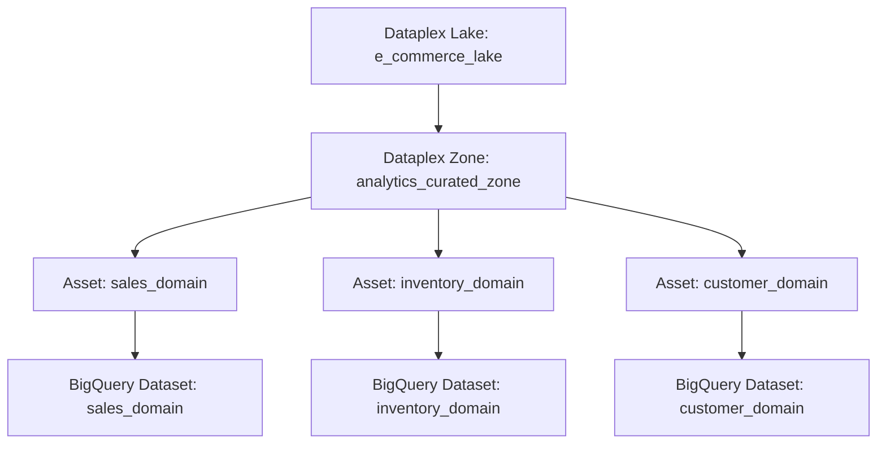
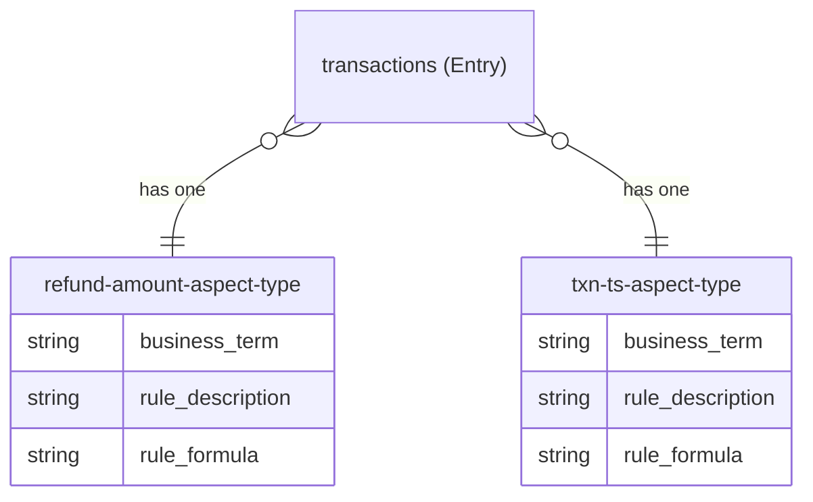
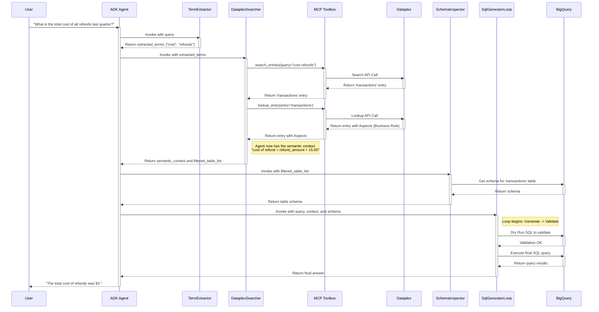

# Tutorial: Building a Semantically-Aware SQL Agent with Dataplex, ADK, and MCP Toolbox

Welcome! This tutorial is for technologists who are new to building AI agents, managing data with Google Cloud, or both. We'll walk you through a complete, real-world example of how to make a good AI agent *great* by giving it a deeper understanding of the data it's working with.

**What You'll Learn:**

*   **The "Why":** Why a simple SQL-generating agent isn't enough and how a data catalog like Dataplex solves real business problems.
*   **Infrastructure as Code (IaC):** How to define and create a complete data environment (BigQuery datasets, tables) and a data catalog (Dataplex) using Terraform.
*   **Dataplex Fundamentals:** What Lakes, Zones, Assets, Entries, and Aspects are, and how they create a rich, semantic layer over your data.
*   **MCP Toolbox:** How this powerful tool acts as a secure bridge between your AI agent and your cloud data services.
*   **ADK Agent Development:** How to build an agent that can reason, use tools, and follow a multi-step process to answer complex questions.
*   **End-to-End Flow:** You'll see every step an agent takes, from receiving a natural language question to generating a semantically correct SQL query.

By the end, you'll understand not just the "how" but the "why" behind building intelligent, context-aware data agents.

---

## Part 1: The Foundation - Infrastructure with Terraform

Before our agent can do anything, it needs data and a catalog to describe that data. Manually creating these resources in the cloud is slow and error-prone. Instead, we use **Infrastructure as Code (IaC)** with [Terraform](https://www.terraform.io/) to define our entire setup in simple, readable files.

Think of Terraform as a blueprint for your cloud environment. You write down what you want (e.g., "one database, three tables, one data catalog"), and Terraform builds it for you automatically.

### Step 1.1: Creating the Data Warehouse (BigQuery)

Our agent will work with an e-commerce dataset. The file [`terraform/bigquery.tf`](../terraform/bigquery.tf) defines this.

*   **What it does:** It creates three separate [BigQuery Datasets](https://cloud.google.com/bigquery/docs/datasets-intro): `sales_domain`, `inventory_domain`, and `customer_domain`. Within these, it creates four tables: `transactions`, `products`, `customers`, and `feedback`.
*   **Why it does this:** Separating tables into different datasets (domains) is a common practice that mirrors real-world business organization. It also allows for more granular security and management.

A key part of this file is the `provisioner "local-exec"` block:

```hcl
# From terraform/bigquery.tf
resource "google_bigquery_table" "transactions" {
  # ... table definition ...

  provisioner "local-exec" {
    command = "bq load --autodetect --skip_leading_rows=1 ${google_bigquery_dataset.sales_domain.dataset_id}.${self.table_id} ../data/transactions.csv"
  }
}
```

This is a powerful feature. It tells Terraform: "After you successfully create this BigQuery table, run a command on my local machine to load the sample CSV data into it." This means a single `terraform apply` command both builds the warehouse and fills it with data.

### Step 1.2: Building the Data Catalog (Dataplex)

Now that we have data, we need to describe it. This is where [Google Cloud Dataplex](https://cloud.google.com/dataplex/docs) comes in. Dataplex allows us to create a unified catalog over our data, no matter where it's stored.

The file [`terraform/dataplex.tf`](../terraform/dataplex.tf) defines the structure of our catalog.

*   **`google_dataplex_lake`:** A Lake is the top-level organizational unit in Dataplex. We create one called `e-commerce-lake` to house all data related to our e-commerce business.
*   **`google_dataplex_zone`:** A Zone sits within a Lake and helps organize data by its state. We create a `CURATED` zone called `analytics_curated_zone`, signaling that the data here is clean, validated, and ready for analysis.
*   **`google_dataplex_asset`:** An Asset connects a Zone to an actual data resource. We create three assets to link our three BigQuery datasets (`sales_domain`, `inventory_domain`, `customer_domain`) to our curated zone.

This creates a clear, hierarchical structure for our data catalog.



### Step 1.3: Adding the "Semantic" Layer (Dataplex Aspects)

This is the most critical part of our setup and a key concept to understand. The schema tells us a column's name (`txn_ts`) and type (`TIMESTAMP`), but it doesn't tell us what it *means* ("This is the transaction timestamp"). Dataplex lets us attach this business context using **Aspects**.

*   **Entry:** When Dataplex discovers a BigQuery table, it creates an **Entry** for it in the catalog. An Entry is the metadata record for that table.
*   **Aspect Type:** An **Aspect Type** is a *template* for a piece of metadata. It defines the structure, like a form with blank fields.
*   **Aspect:** An **Aspect** is a *filled-out form*, an instance of an Aspect Type, that you attach to an Entry.

**The Golden Rule:** An Entry can only have **one Aspect of a given Aspect Type**.

This is the mistake we learned from! If you want to attach metadata to five different columns in a table, you need to create five different Aspect Types.

The file [`terraform/dataplex_metadata.tf`](../terraform/dataplex_metadata.tf) defines these templates.

```hcl
# From terraform/dataplex_metadata.tf
resource "google_dataplex_aspect_type" "refund_amount_aspect_type" {
  project          = var.project_id
  location         = var.region
  aspect_type_id   = "refund-amount-aspect-type"
  # ... metadata_template definition ...
}

resource "google_dataplex_aspect_type" "txn_ts_aspect_type" {
  project          = var.project_id
  location         = var.region
  aspect_type_id   = "txn-ts-aspect-type"
  # ... metadata_template definition ...
}
```

*   **What it does:** We define a unique `google_dataplex_aspect_type` for each column we want to enrich (e.g., `refund_amount`, `txn_ts`). The `metadata_template` inside defines the fields for our metadata: `business_term`, `rule_description`, and `rule_formula`.
*   **Why it does this:** This allows us to attach a specific, unique piece of metadata to each column of a table's Entry, following the "one aspect per type" rule.

Finally, the `null_resource "attach_dataplex_metadata"` block in this file runs our Python script ([`scripts/attach_metadata.py`](../scripts/attach_metadata.py)) to actually *create and attach* the Aspects after the tables and aspect types have been created.

This diagram shows the relationship for our `transactions` table:



**Further Reading:**
*   [Dataplex Concepts Overview](https://cloud.google.com/dataplex/docs/introduction#dataplex_concepts)
*   [Terraform `google_dataplex_lake` Docs](https://registry.terraform.io/providers/hashicorp/google/latest/docs/resources/dataplex_lake)
*   [Terraform `google_dataplex_zone` Docs](https://registry.terraform.io/providers/hashicorp/google/latest/docs/resources/dataplex_zone)
*   [Terraform `google_dataplex_asset` Docs](https://registry.terraform.io/providers/hashicorp/google/latest/docs/resources/dataplex_asset)
*   [Terraform `google_dataplex_aspect_type` Docs](https://registry.terraform.io/providers/hashicorp/google/latest/docs/resources/dataplex_aspect_type)

---

## Part 1.5: The Automation Script - Attaching Metadata

We've seen how Terraform creates the *templates* for our metadata (the Aspect Types), but how does the actual metadata get attached to the right table columns? This is handled by the Python script at [`scripts/attach_metadata.py`](../scripts/attach_metadata.py).

This script is the glue that connects our business knowledge to our data catalog. It's triggered automatically by the `null_resource "attach_dataplex_metadata"` block in our Terraform setup, running after all the BigQuery and Dataplex resources are created.

### Why a Script is Necessary

You might wonder why we need a separate script. Why can't Terraform do this? The reason lies in the difference between *declaring state* and *performing actions*.

Terraform is excellent at declaring the desired state of your infrastructure: "I want a lake and three aspect types to exist." However, the Google Cloud provider for Terraform does not currently have a resource for performing the specific, procedural action of "attach this specific aspect to this specific column on this specific table entry." This is a fine-grained API update, not a standalone resource.

This is a common pattern in IaC: we use Terraform to build the foundational resources and then use a script with a client library (like the Google Cloud SDK for Python) to perform more detailed, programmatic configuration on those resources.

### How It Works

The script uses the official Google Cloud Dataplex client library for Python to programmatically find the Dataplex entries for our tables and attach the aspects we defined.

**1. The `domain_map`**

At the heart of the script is a Python dictionary called `domain_map`. This is our source of truth for what metadata to attach where.

```python
# From scripts/attach_metadata.py
domain_map = {
    "sales_domain": {
        "transactions": [
            ("refund_amount", "refund-amount-aspect-type", {
                "business_term": "Refund Processing Fee",
                "rule_description": "A $15.00 processing fee is added to the cost of every refund.",
                "rule_formula": "+ 15.00",
            }),
            ("txn_ts", "txn-ts-aspect-type", {"business_term": "Transaction Timestamp"}),
        ]
    },
    # ... other domains and tables ...
}
```
The script iterates through this structure, giving it the exact dataset, table, column, aspect type, and data payload needed for each piece of metadata.

**2. The `attach_aspect` Function**

This function does the heavy lifting. For each item in the `domain_map`, it performs several key actions:

*   **Waiting for Discovery:** After a table is created, it can take a moment for Dataplex's discovery service to find it and create a catalog Entry. The script anticipates this with a polling loop, repeatedly trying to fetch the Entry until it succeeds. This makes our automation robust.

*   **Targeting the Column:** To attach an aspect to a *specific column* instead of the whole table, the script sets a special `path` on the aspect.
    ```python
    aspect.path = f"schema.fields.{column}"
    ```
    This tells Dataplex precisely where in the table's schema this piece of metadata belongs.

*   **Making the API Call:** Finally, it builds and sends the `UpdateEntryRequest`. As we learned, it's critical to include the `aspect_keys` parameter in this request to tell the API which specific aspects we are adding or modifying.

This script is a perfect example of how to automate data governance and enrichment, turning a manual annotation process into a repeatable, version-controlled part of your infrastructure deployment.

---

## Part 2: The Bridge - MCP Toolbox

Now we have our infrastructure. How does our agent talk to it? We use the [MCP Toolbox](https://github.com/googleapis/genai-toolbox).

MCP Toolbox is a server that exposes cloud services (like BigQuery and Dataplex) as a standardized set of tools that an AI agent can easily use. It handles authentication, simplifies complex APIs, and provides a secure, consistent interface.

We configure it in the [`tools.yaml`](../tools.yaml) file.

```yaml
# From tools.yaml
sources:
  bigquery-public-data:
    kind: bigquery
    project: ${GOOGLE_CLOUD_PROJECT}
    writeMode: blocked
  dataplex:
    kind: dataplex
    project: ${GOOGLE_CLOUD_PROJECT}

tools:
  search_entries:
    kind: dataplex-search-entries
    source: dataplex
    description: Search for entries in Dataplex Catalog.

  lookup_entry:
    kind: dataplex-lookup-entry
    source: dataplex
    description: Retrieve a specific entry from Dataplex Catalog.
```

*   **`sources`:** This section defines our connections. We create a `dataplex` source, telling the toolbox which Google Cloud project to connect to.
*   **`tools`:** This section defines the specific actions our agent can take. We expose `search_entries` and `lookup_entry`, linking them to our `dataplex` source.

When we run `uv run honcho start`, it starts the MCP Toolbox server, which reads this file and makes these tools available for our agent.

---

## Part 3: The Brains - The ADK Agent

The [Agent Development Kit (ADK)](https://google.github.io/adk-python/) is a framework for building agents. Our main agent is a `SequentialAgent`, which is like a pipeline of smaller, specialized agents that run one after another.

The magic happens in the `SemanticEnricher` agent, which is defined in [`agents/sql_agent/semantic_enricher.py`](../agents/sql_agent/semantic_enricher.py). It's also a `SequentialAgent` with two sub-agents:

### 1. The `TermExtractor`

*   **Job:** To find the important business words in the user's question.
*   **Prompting Strategy:** Its prompt is very simple and direct.
    > You are the Term Extractor. Your sole responsibility is to extract key business concepts from the user's natural language query. Ignore common filter conditions (like dates) and aggregation words (like 'total', 'average'). Output a JSON array of strings...

    This focused prompt ensures it does one job well and doesn't get distracted. For the query "What is the total cost of all refunds last quarter?", it correctly extracts `["cost", "refunds"]`.

### 2. The `DataplexSearcher`

*   **Job:** To take the business terms and find relevant data assets and business rules in Dataplex.
*   **Prompting Strategy:** This agent's prompt is much more detailed. It instructs the agent on exactly how to behave and which tools to use.
    > Read the `extracted_terms` from the session state. Use the `search_entries` tool to find data assets... For each unique data asset found, call the `lookup_entry` tool... Consolidate the retrieved semantic context into a well-structured Markdown string...

    This is a classic "Reason and Act" (ReAct) pattern. The prompt tells the agent:
    1.  **What to read:** `extracted_terms`.
    2.  **What to do first:** Call `search_entries`.
    3.  **What to do next:** Call `lookup_entry`.
    4.  **How to format the output:** A specific Markdown structure.

This structured prompting turns the LLM from a simple text generator into a reasoning engine that can execute a multi-step plan using tools.

---

## Part 4: Putting It All Together - An End-to-End Example

Let's trace the user's query: **"What is the total cost of all refunds last quarter?"**

**Step 1: Term Extraction**
*   The `SemanticEnricher` runs its first sub-agent, `TermExtractor`.
*   **Input:** `"What is the total cost of all refunds last quarter?"`
*   **Action:** The LLM follows its simple prompt.
*   **Output:** The JSON array `["cost", "refunds"]` is saved to the session state.

**Step 2: Dataplex Search**
*   The `DataplexSearcher` agent runs next.
*   **Input:** It reads `["cost", "refunds"]` from the session state.
*   **Action 1 (Tool Call):** It calls `search_entries(query="cost refunds")`. MCP Toolbox translates this into a Dataplex API call. Dataplex search is powerful and finds the `transactions` table because its columns (`sale_amount`, `refund_amount`) and attached metadata are relevant.
*   **Action 2 (Tool Call):** The agent gets the `transactions` table Entry back. It then calls `lookup_entry` on this Entry to get all the juicy details, including the Aspects we attached.
*   **Output:** The agent receives the full entry, including the `refund-amount-aspect-type` Aspect, which contains our business rule: `rule_formula: "+ 15.00"`.

**Step 3: Context Consolidation**
*   **Action:** The `DataplexSearcher` follows its prompt to format the information it found into a Markdown string.
*   **Output:** The following string is saved to the `semantic_context` in the session state:
    ```markdown
    ## Relevant Tables
    - `sales_domain.transactions`

    ## Column Descriptions
    - `refund_amount`: The amount refunded to the customer.

    ## Business Rules
    - The business cost of a refund is `refund_amount + 15.00` (for a processing fee).
    ```
    It also saves `['sales_domain.transactions']` to the `filtered_table_list`.

**Step 4: Targeted Schema Inspection**
*   The `SchemaInspector` agent (defined in [`agents/sql_agent/schema_inspector.py`](../agents/sql_agent/schema_inspector.py)) runs. Instead of scanning all tables, it reads the `filtered_table_list` and only fetches the schema for `sales_domain.transactions`. This is much more efficient.

**Step 5: Semantically-Aware SQL Generation**
*   The `SqlGeneratorLoop` (defined in [`agents/sql_agent/sql_generator_loop.py`](../agents/sql_agent/sql_generator_loop.py)) begins. Its `Generator` agent receives a prompt (from [`agents/sql_agent/prompts.py`](../agents/sql_agent/prompts.py)) that has been dynamically updated to include the `semantic_context`.
*   **Input (Partial Prompt):**
    > You will be provided with...
    > `schema`: (Schema for `sales_domain.transactions`)
    > `query`: "What is the total cost of all refunds last quarter?"
    > `semantic_context`:
    > ## Business Rules
    > - The business cost of a refund is `refund_amount + 15.00` (for a processing fee).

*   **Action:** The LLM now has the crucial business rule. It knows "total cost of refunds" isn't just `SUM(refund_amount)`, but `SUM(refund_amount + 15.00)`.
*   **Output (Generated SQL):**
    ```sql
    SELECT
      SUM(t.refund_amount + 15.00) AS total_refund_cost
    FROM
      `your-project-id.sales_domain.transactions` AS t
    WHERE
      t.txn_ts >= TIMESTAMP_TRUNC(CURRENT_TIMESTAMP(), QUARTER, -1)
      AND t.txn_ts < TIMESTAMP_TRUNC(CURRENT_TIMESTAMP(), QUARTER)
      AND t.refund_amount > 0
    ```

The rest of the agent pipeline validates this SQL and executes it, returning the correct, semantically-aware answer to the user.

## Visualizing the Flow: Sequence Diagram

This diagram shows the entire end-to-end process, from the user's question to the final answer.



## Conclusion

You've now seen the full lifecycle of how a modern AI agent can leverage a data catalog. By using Terraform to define our environment, MCP Toolbox to provide secure tool access, and ADK to build a reasoning agent, we've elevated our agent from a simple code generator to a true data analyst's assistant that understands the *meaning* behind the data.